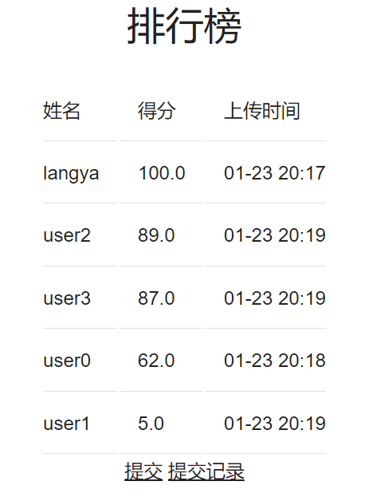
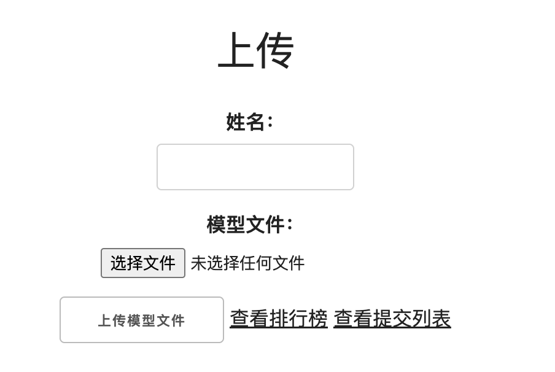

## 项目简介

基于Django、Celery搭建的一个简单机器学习模型评测系统。

适合用于小规模的课程验收成果。

## 功能清单
- [X] 异步响应评测队列
- [X] 评测结果可视化
- [X] 用户管理
- [ ] 提交模型下载
- [ ] 异常处理
## 依赖
```python
celery==5.3.6  
celery-progress==0.3  
Django==4.2.9  
django-celery-beat==2.5.0  
django-timezone-field==6.1.0  
gunicorn==21.2.0  
redis==4.6.0  
torch==2.1.2
```

## 运行
```shell
git clone
pip install -r requirements.txt
python manage.py makemigrations
python manage.py migrate
celery -A model_score_project worker --loglevel=info --concurrency=1 -D
python manage.py runserver
```

## 部署
建议采用gunicorn部署
```shell
gunicorn -c gunicorn.conf.py model_score_project.wsgi:application
```

## 界面展示
**排行榜**



**提交**

